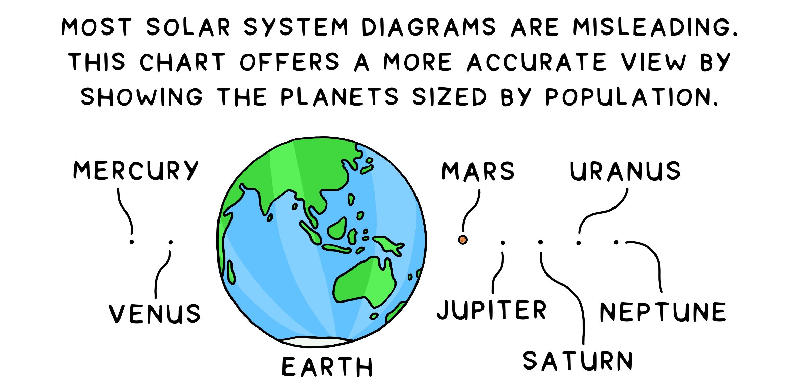 

# Explanation

 1. What is a cartogram?

Simply put, a cartogram is a map. But a cartogram is a unique type of map that combines statistical information such as population with geographic location. Typically, physical or topographical maps show relative area and distance, but they do not provide any data about the inhabitants or the population of a place. For example, a quick and intuitive view of the world map in relation to population makes it easy for viewers to co-relate the effect and the relative measure's gravity. 

The basic idea is distorting the map by resizing the regions by population (or any other metric) since the population is among the most important aspects to consider; for example, if malnutrition is high in a vast country, then the severity is much worse than if malnutrition is high in a tiny country.

 2. How are grids related to cartograms?

With an objective to plot a visually conclusive map by illustrating territories using a method for trading off shape and area.

It’s vital to ensure the shape or the outline of a region (Example: Country and Province) is preserved, i.e., visualization steps have to be in place so that the resulting cartograms appear similar to the original world cartograms, such that the area is easily recognizable only by its appearance without the explicit need for labels and quickly understand the displayed data.

While generating a cartogram algorithmically yields good results, the best cartograms out there are the ones that as designed artistically/manually. This boils down to finding a balance between using algorithms to generate cartograms and manually nitpicking fine details - that's where the grids come into the picture.

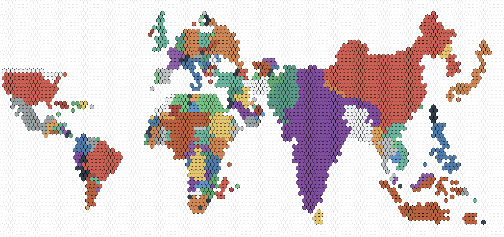 

Figure 1: Hex grid cartogram. 

 3. Choosing the right grid

Grids are built from a repetition of simple shapes such as squares and hexagons. Grids have three types of parts: faces (tiles), edges, and vertices.

<ul>
<li>Each face is a two-dimensional surface enclosed by edges. </li>

<li>Each edge is a one-dimensional line segment ending at two vertices. </li>

<li>Each vertex is a zero-dimensional point</li>
</ul>

<h3 id="square">Square</h3>

One of the most commonly used grids is a square grid. It's simple, easy to work with, and maps nicely onto a computer screen. The location uses cartesian coordinates (x, y), and the axes are orthogonal. Not to mention, the coordinate system is the same even if the squares are angled in an isometric or axonometric projection.

<ul>
<li>Squares are 4-sided polygons. </li>

<li>Squares have all the sides the same length. </li>

<li>They have 4 sides and 4 corners.</li>

<li>Each side is shared by 2 squares. </li>

<li>Each corner is shared by 4 squares.</li>
</ul>

<h3 id="hexagon">Hexagon</h3>

Hexagonal grids are the next commonly used grids, as they offer less distortion of distances than square grids because each hexagon has more non-diagonal neighbors than a square (diagonals distort grid distances). Moreover, hexagons have a pleasing appearance (the honeycomb is a good example). As for the grids, the position is either pointy tops and flat sides or flat tops and pointy sides.

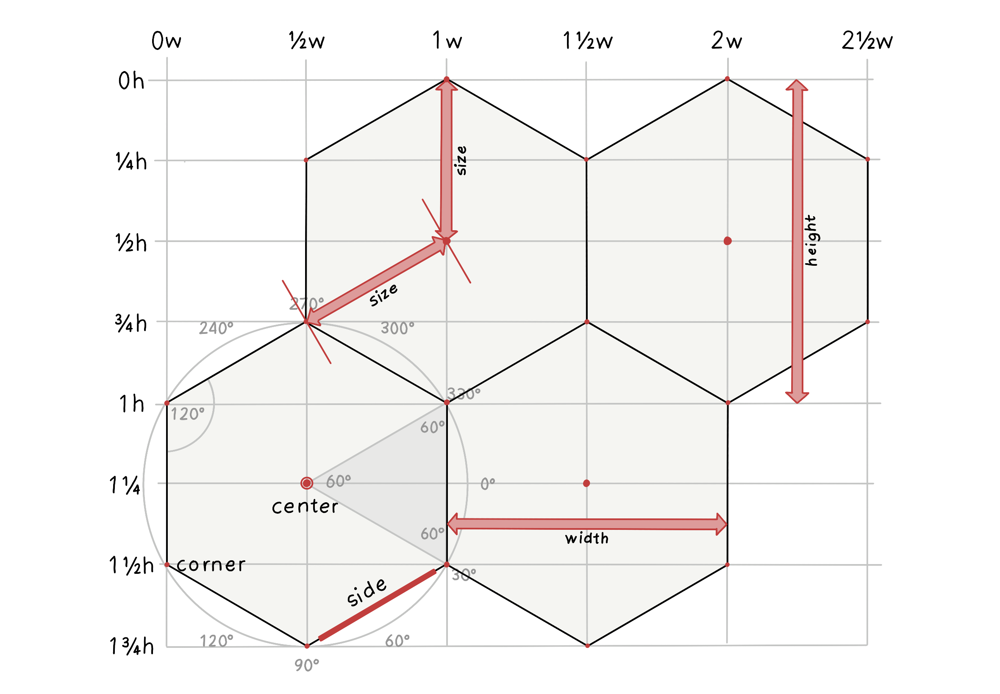 

Figure 2: Modified from original Image source: <a href="https://www.redblobgames.com/grids/hexagons" target="_blank">@redblobgames</a>

<ul>
<li>Hexagons are 6-sided polygons. </li>

<li>Regular hexagons have all the sides the same length. </li>

<li>They have 6 sides and 6 corners.</li>

<li>Each side is shared by 2 hexagons. </li>

<li>Each corner is shared by 3 hexagons.</li>

<li>Typically, the orientations for hex grids are vertical columns (flat-topped) and horizontal rows (pointy-topped).</li>
</ul>

 4. Hexagons vs Squares

<h3 id="squaregrids">Square grids</h3>

<ul>
<li>
Square grids are universally used in Raster datasets in GIS. 
</li>

<li>
Ease of definition and storage: the only explicit geographical information necessary to define a raster grid are the coordinates of the origin, cell size, and grid dimensions, i.e., the number of cells in each direction. The attribute data can be stored as an aspatial matrix, and the geographical location of any cell can be derived from the cell’s position relative to the origin - this makes data storage and retrieval easier since the coordinates of the vertices of each grid cell are not explicitly stored.
</li>

<li>
Ease of resampling to different spatial scales: increasing the spatial resolution of a square grid is just a matter of dividing each grid cell into four. Similarly, decreasing the spatial resolution only requires combining groups of four cells into one.
</li>
</ul>

<h3 id="hexagonalgrids">Hexagonal grids</h3>

<ul>
<li>
Reduced edge effects: a hexagonal grid gives the lowest perimeter to area ratio of any regular tessellation of the plane - this means that edge effects are minimized when working with hexagonal grids.
</li>

<li>
All neighbours are identical: square grids have two classes of neighbours, those in the cardinal directions that share an edge and those in diagonal directions that share a vertex. In contrast, a hexagonal grid cell has six identical neighboring cells, each sharing one of the six equal-length sides. Furthermore, the distance between centroids is the same for all neighbors.
</li>

<li>
Better fit to curved surfaces: when dealing with large areas, where the curvature of the earth becomes important, hexagons are better able to fit this curvature than squares (this is why soccer balls are constructed of hexagonal panels).
</li>
</ul>

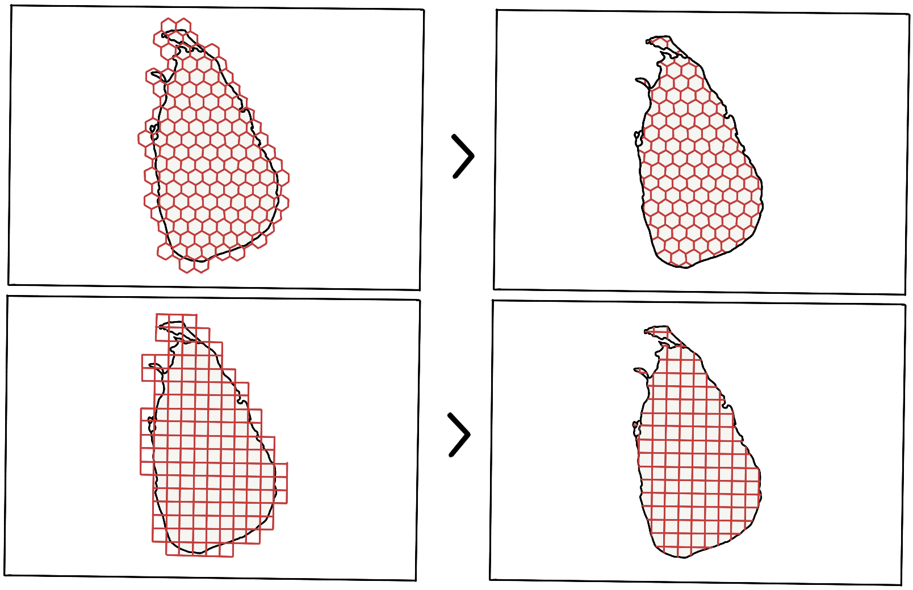 

Figure 3: Tessellation of the plane (Square and Hexagon). 

<h3 id="hexagonalgridforcartograms">Hexagonal grid for Cartograms</h3>

For a cartogram, the reasons to choose hexagons over squares are as follows:

<ul>
<li>
It's a better fit for curved surfaces, thereby supporting most geographic projections.
</li>

<li>
Representing a complex-shaped polygon by hexagons offers a lower error factor (tessellation of the plane), i.e., (the actual area of the polygon - Area formed by tiny tiles/hexagons) is lower as compared to that formed by squares.
</li>

<li>
They look badass! Without a doubt, hexagonal grids look way more impressive than square grids.
</li>
</ul>

 5. Building a shape preserved hexagonal grid cartogram

Since the primary dependency is D3 - a Javascript library extensively used for drawing geographic visualizations and uses <a href="https://geojson.org">GeoJSON</a>/<a href="https://en.wikipedia.org/wiki/GeoJSON">TopoJSON</a> for representing shapes on maps by converting them to rendered SVG element(s); explanations are supported by implementation details in D3.

 5.1. Projection

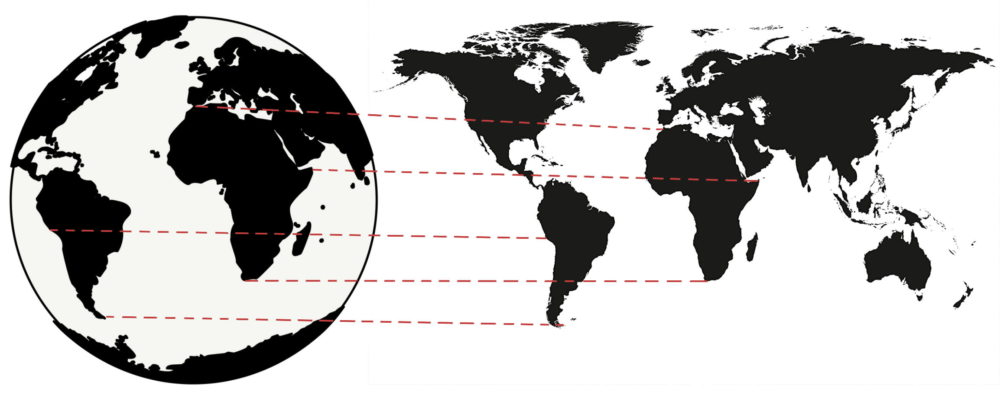 

Figure 4: Mercator projection. 

Earth is round or more accurately, an ellipsoid. To show its features on a flat surface, it's not possible to accurately translate a sphere onto a plane, hence the need for projections. For instance, the Mercator projection is famously known to over-exaggerate the size of landmasses near the poles (No wonder Greenland looks massive). 

D3 offers a range of built-in <a href="https://github.com/d3/d3-geo-projection">projections</a>; however, no projection accurately depicts all points in the globe, so it's important to choose the appropriate projection for the use case. The purpose is simple: translate the latitude and longitude pair to a pair of X and Y coordinates on SVG. Lastly, to fit the coordinates to the SVG element, the <code>fitExtent</code> and <code>rotate</code> are handly, as the projection has no knowledge of the size or extent of the SVG element.

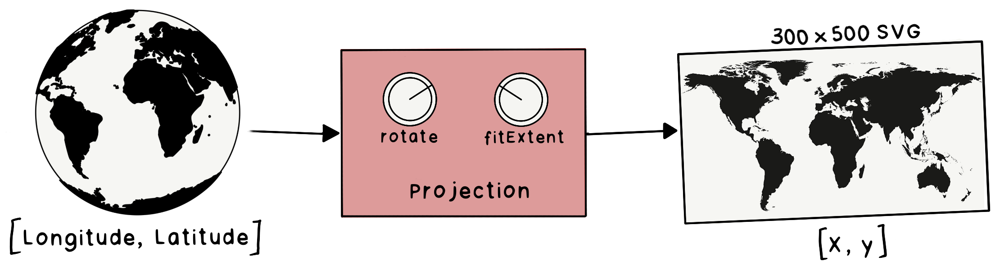 

Figure 5: Projection function to map coordinate. 

 5.2. Geopath

The projection function works well for converting points into X and Y coordinates but not lines. A typical map has regions represented by lines and not individual points. Hence to render the map, irregular lines are represented using the <a href="https://developer.mozilla.org/en-US/docs/Web/SVG/Tutorial/Paths">path</a> element.
The <code>d</code> attribute in <code>&lt;path&gt;&lt;/path&gt;</code> defines the shape of the line.

<pre><code>  &lt;path
    d="M732.4944016581658,608.9022205707863L727.1354648887938,
    610.9411167803873L706.8155159265721,604.6447353677604L703.587646715891,
    610.7806528270128L688.0319490712842,611.8868016539795L688.8280117925813, 
    ......
    ......
    ......
    600.4706783128443L788.2046582778905,605.2215195516151L781.7980088643487,
    600.5439608373076L772.9856281618564,600.8681045994042L760.5726799028025,
    607.2632255686299L744.3618779892297,607.9935254189165L742.5384536592165,
    615.3237961667451Z"
    stroke="white"
    fill="rgb(211, 211, 211)"
  &lt;/path&gt;
</code></pre>

Ussage in D3: <code>const path = d3.geoPath().projection(projection)</code>, the <code>path</code> functions takes <code>GeoJSON</code> polygons, and returns a string which can directly be used as the <code>d</code> attribute of an SVG path.

To render the map, the plan is to:

<ul>
<li>Loop through each country’s <code>GeoJSON</code> polygon</li>

<li>Create the <code>d</code> attribute string using the <code>d3.geopath</code> function</li>

<li>Create and append an SVG path element with the above <code>d</code> attribute</li>
</ul>

 5.3. Tessellation

A tessellation or tiling is a process of covering a surface or a plane, using one or more geometric shapes, called tiles, with no overlaps or gaps. Furthermore, a variant of symmetric tessellation has a fixed tile size and geometric shape.

Figure 3 shows the tessellation of Sri Lanka using a Hexagon and Square as the tile/cell. However, with the tessellation of a polygon, only the tiles within the polygon are arranged in the same order. Whereas, when dealing with multiple polygons in the same grid, the arrangement of tiles has to be based on the nearest tile that fits in the grid - implying the need for a point grid.

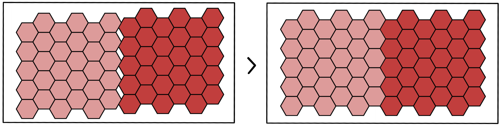 

Figure 6: Consistent Tessellation in a Grid. 

 5.4. Tessellation of n polygons

Putting it all together, 

<ul>
<li>the first step is forming a grid of points, where each point represents the center of the tile (hexagon/square). Figure 7 shows the point grid for hexagon tiles.</li>

<li>The next step is to draw the tile relative to each point in the grid (tessellate points), forming the base playground - Then, superimpose the set of polygons (Features in TopoJSON) on the grid playground. </li>

<li>Finally, tessellate each of the polygons by ensuring the tiles chosen are from the previously formed grid of tiles.</li>
</ul>

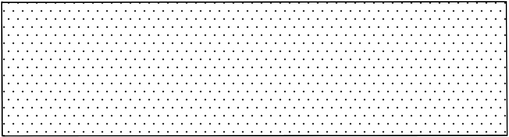 

Figure 7: Point grid of (Width x Height). 

 

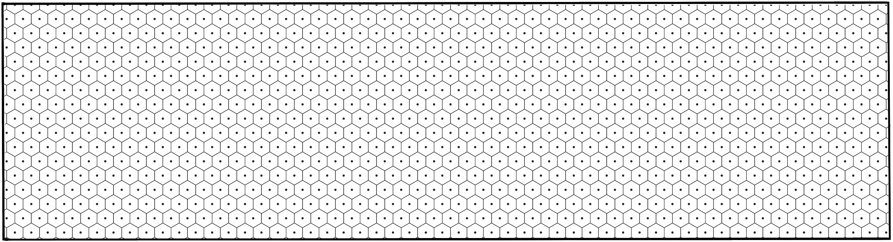 

Figure 8: Tessellate points with hexagons 

 

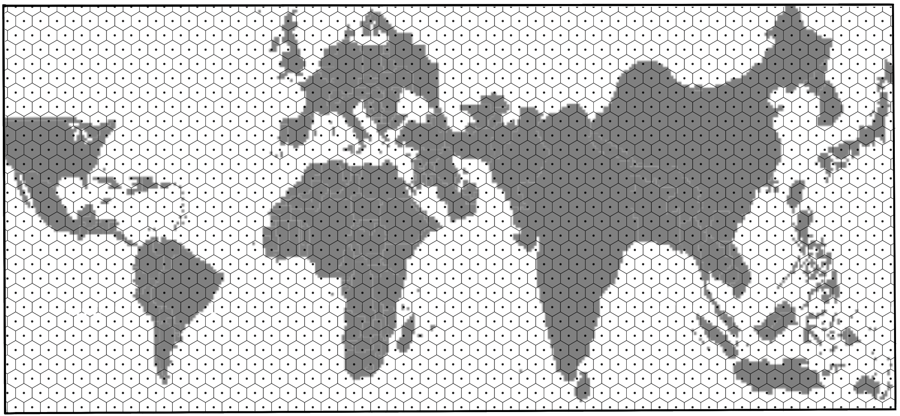 

Figure 9: Draw the TopoJSON on Canvas (the above TopoJSON is the world map scaled by population of 2018). 

 

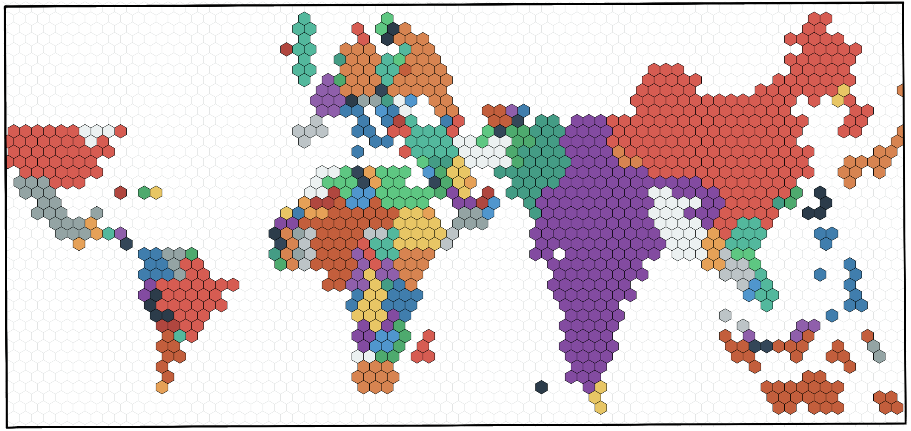 

Figure 10: Regularly tessellate each country/polygon in the world-map with hexagons. 

 5.5. Plotting a cartogram

This section is a word in progress, stay tuned! 🤓

The algorithm for generating a cartogram is a variant of continuous area cartograms by James A. Dougenik, Nicholas R. Chrisman, and Duane R. Niemeyer. 

The research paper: <a href="http://lambert.nico.free.fr/tp/biblio/Dougeniketal1985.pdf">An Algorithm to Construct Continous Area Cartograms</a>. Without getting into the exact details, line-by-line, the procedure to produce cartograms is as follows: 

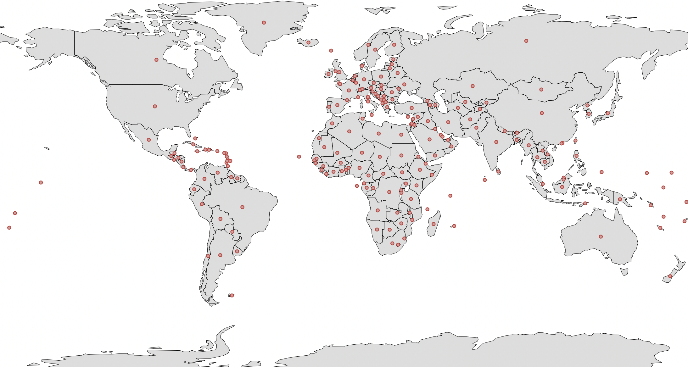 

Figure 11: Centroid of all polygons/countries. 

 5.6. Fixed vs Fluid mode

<strong>Fixed:</strong> The cell size is <code>fixed</code> across years. The cell size is the population count of each cell (a country with a population of 10 million has 20 cells when the cell size is 0.5 million). Irrespective of the year/total population, the cell size remains the same in the <code>Fixed</code> mode.

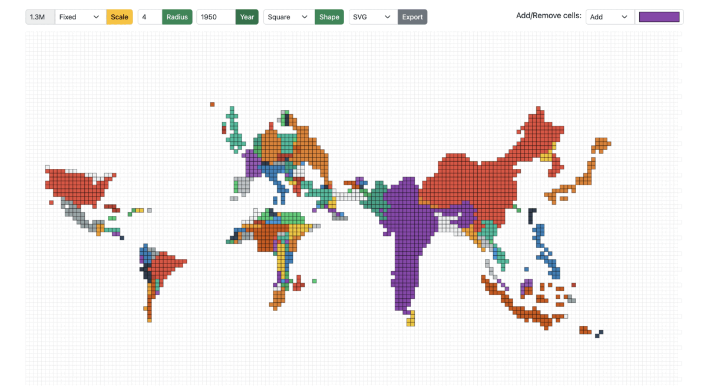 

Figure 13: Cartogram scaled from 1950 to 1990 in Fixed mode 

<strong>Fluid:</strong> On the other hand, in the fluid mode, as the year/total population changes, the cell size is adjusted accordingly to best utilize the entire screen/container to display the cartogram. For example: A region with a total population of 20 million and a cell size of 0.5 million would have the same view when the total population is 40 million, and the cell size is 1 million.

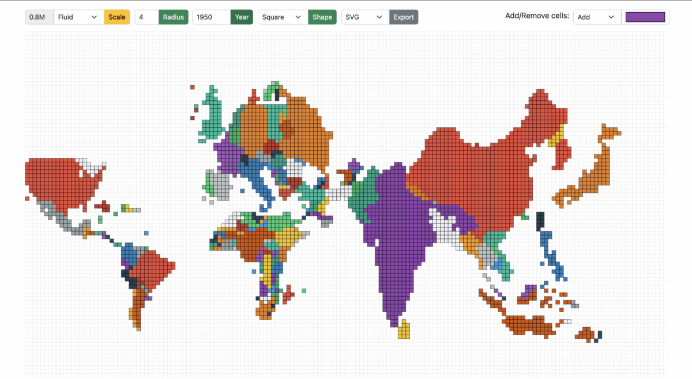 

Figure 14: Cartogram scaled from 1950 to 1990 in Fluid mode 

 

# Implementation

 6. Dependencies

<pre><code>"d3": "^7.4.3",
"d3-array": "^3.1.6",
"d3-geo": "^3.0.1",
"d3-hexbin": "^0.2.2",
"topojson-client": "^3.1.0",
"topojson-server": "^3.0.1",
"topojson-simplify": "^3.0.3"
</code></pre>

 7. Project Structure

The <code>core</code> module:

<ul>
<li>
<code>index.html</code>: HTML page of the main screen containing the root container and input form fields such as year, radius, scale mode, cell size, export format, and cell color selector.
</li>

<li>
<code>cartogram.js</code>: Implementation of the algorithm to construct continuous area cartograms.
</li>

<li>
<code>plot.js</code>: The logic for rendering the tessellated point-grid and plotting the cartogram based on the selected input fields.
</li>

<li>
<code>shaper.js</code>: Functions dependent on the cell shape; the common pattern followed is to take decisions based on the cell shape using a switch case.
</li>

<li>
<code>events.js</code>: All the mouse events in the application, such as single/double click, hover, and drag/drop.
</li>
</ul>

8. Project Files

 

8.1. <a target="_blank" href="https://github.com/owid/cartograms/blob/main/index.html">index.html</a>

<h3>Create a HTML <code>div</code> with a unique <code>id</code></h3>

To append SVG, i.e., the hexagonal grid and polygons/regions of the cartogram (derived from the topojson).

<pre><code class="html language-html">&lt;div class="container-fluid"&gt;
    &lt;div id="container"&gt;&lt;/div&gt;
&lt;/div&gt;
</code></pre>

8.2. <a target="_blank" href="https://github.com/owid/cartograms/blob/main/core/catogram.js">cartogram.js</a>

 Without getting into the exact details, line-by-line, the procedure to produce cartograms is as follows: 

<h3 id="calculateforcereductionfactor">Calculate Force Reduction Factor</h3>

The "force reduction factor" is a number less than 1, used to reduce the impact of cartogram forces in the early iterations of the procedure. The force reduction factor is the reciprocal of one plus the mean of the size error. The size error is calculated by the ratio of area over the desired area (if area is larger) or desired area over area in the other case.

<pre><code>For each polygon
  Read and store PolygonValue (negative value illegal)
  Sum PolygonValue into TotalValue
</code></pre>

<pre><code>For each iteration (user controls when done)
  For each polygon
      Calculate area and centroid (using current boundaries)
  Sum areas into TotalArea
  For each polygon
      Desired = (TotalArea * (PolygonValuelTotaIValue))
      Radius = SquareRoot (Area / π)
      Mass = SquareRoot (Desired / π) - SquareRoot (Area / π)
      SizeError = Max(Area, Desired) / Min(Area, Desired)
</code></pre>

<h3 id="moveboundarycoordinates">Move boundary co-ordinates</h3>

The brute force method (fixed small number of polygons): the forces of all polygons/countries act upon every boundary coordinate. As long as the number of polygons is relatively small (under 500), distortions can be computed for a rather complex line work (thousands of points). Furthermore, the computation of force effects could be restricted by implementing a search limitation to exclude infinitesimal forces from far-away polygons.

<pre><code>  ForceReductionFactor = 1 / (1 + Mean (SizeError))
  For each boundary line; Read coordinate chain
      For each coordinate pair
          For each polygon centroid
              Find angle, Distance from centroid to coordinate
                If (Distance &gt; Radius of polygon): Fij = Mass * (Radius / Distance)
                Else: Fij = Mass * (Distance^2 / Radius^2) * (4 - 3 * (Distance / Radius))
          Using Fij and angles, calculate vector sum
          Multiply by ForceReductionFactor
          Move coordinate accordingly
      Write distorted line to output and plot result
</code></pre>

8.3. <a target="_blank" href="https://github.com/owid/cartograms/blob/main/core/plot.js">plot.js</a>

<h3 id="createapointgrid">Create a point grid</h3>

A point grid is a matrix containing the centers of all the cells in the grid.

<pre><code class="javascript language-javascript">  let cellRadius = cellDetails.radius;
  let cellShape = cellDetails.shape;

  let shapeDistance = getRadius(cellRadius, cellShape);
  let cols = width / shapeDistance;
  let rows = height / shapeDistance;
  let pointGrid = d3.range(rows * cols).map(function (el, i) {
    return {
      x: Math.floor(i % cols) * shapeDistance,
      y: Math.floor(i / cols) * shapeDistance,
      datapoint: 0,
    };
  });
</code></pre>

The <code>shapeDistance</code> is different for different cell-shapes. For example:

<pre><code class="javascript language-javascript">  switch (cellShape) {
      case cellPolygon.Hexagon:
        shapeDistance = radius * 1.5;
      case cellPolygon.Square:
        shapeDistance = radius * 2;
    }
</code></pre>

 

<h3 id="plotthehexagonalgridplayground">Plot the hexagonal grid playground</h3>

The playground of cells is as shown in Figure 8, where each point in the grid is tesselated with the respective cell shape. The playground also serves as the never-ending sea/ocean on the world map.

<pre><code class="javascript language-javascript">  d3.select("#container").selectAll("*").remove();
    const svg = d3
      .select("#container")
      .append("svg")
      .attr("width", width + margin.left + margin.top)
      .attr("height", height + margin.top + margin.bottom)
      .append("g")
      .attr("transform", `translate(${margin.left} ${margin.top})`);

  svg
    .append("g")
    .attr("id", "hexes")
    .selectAll(".hex")
    .data(getGridData(cellShape, newHexbin, pointGrid))
    .enter()
    .append("path")
    .attr("class", "hex")
    .attr("transform", getTransformation(cellShape))
    .attr("d", getPath(cellShape, newHexbin, shapeDistance))
    .style("fill", "#fff")
    .style("stroke", "#e0e0e0")
    .style("stroke-width", strokeWidth)
    .on("click", mclickBase);
</code></pre>

8.4. <a target="_blank" href="https://github.com/owid/cartograms/blob/main/core/shaper.js">shaper.js</a>

The <code>shaper.js</code> has all the code snippets that depend on the cells shape. 

Once again, the transformation, SVG path, and binned data points (grid) are dependent on the cell-shape.
For hexagons, the library used: <a href="https://github.com/d3/d3-hexbin">d3-hexbin</a>

<pre><code class="javascript language-javascript">  function getGridData(cellShape, bin, grid) {
    switch (cellShape) {
      case cellPolygon.Hexagon:
        return bin(grid);
      case cellPolygon.Square:
        return grid;
    }
  }
</code></pre>

Translate is one of the support transformations (Translate, Rotate, Scale, and Skew). It moves the SVG elements inside the webpage and takes two values, <code>x</code> and <code>y</code>. The <code>x</code> value translates the SVG element along the x-axis, while <code>y</code> translates the SVG element along the y-axis. 
For example: A single point in a point-grid represents the top-right corner of a square, which is moved by <code>length of the side/2</code> on the x and y-axis using <code>transform.translate(x, y)</code>

<pre><code class="javascript language-javascript">  function getTransformation(cellShape) {
    switch (cellShape) {
      case cellPolygon.Hexagon:
        return function (d) {
          return "translate(" + d.x + ", " + d.y + ")";
        };
      case cellPolygon.Square:
        return function (d) {
          return "translate(" + d.x / 2 + ", " + d.y / 2 + ")";
        };
    }
  }
</code></pre>

To emphasize the ease of extending the solution for other cell shapes, notice the <code>rightRoundedRect</code> that takes <code>borderRadius</code> (zero for a square/rectangle); however, setting it to 50% would result in circular cells.

<pre><code class="javascript language-javascript">  function getPath(cellShape, bin, distance) {
    switch (cellShape) {
      case cellPolygon.Hexagon:
        return bin.hexagon();
      case cellPolygon.Square:
        return function (d) {
          return rightRoundedRect(d.x / 2, d.y / 2, distance, distance, 0);
        };
    }
  }
</code></pre>

 

<h3 id="createthebasecartogram">Create the base cartogram</h3>

The expectation of <code>Cartogram()</code> is to take the current topo-features of the map projection along with the source population count and target population count to return new topo-features (arcs for every polygon/country).

In this example, the base cartogram is a population-scaled world map for the year 2018.

<pre><code class="javascript language-javascript">  var topoCartogram = cartogram()
    .projection(null)
    .properties(function (d) {
      return d.properties;
    })
    .value(function (d) {
      var currentValue = d.properties.count;
      return +currentValue;
    });
  topoCartogram.features(topo, topo.objects.tiles.geometries);
  topoCartogram.value(function (d) {
    var currentValue = populationJson[d.properties.id][year];
    return +currentValue;
  });
</code></pre>

As for the presentation, there are two types: <code>Fixed</code> and <code>Fluid</code>, as shown in Figures 13 and 14.

<strong>Population Factor:</strong> The <code>populationFactor</code> is "1" in <code>FLUID</code> mode and depends on the source and target population ratio in <code>FIXED</code> mode, calculated using back-propagation, where the default <code>populationFactor</code> is 1.6 (mean of expected values across years) and increased/decreased in steps of 0.1 to reach the desired cell-size.

<pre><code class="javascript language-javascript">  var topoFeatures = topoCartogram(
    topo,
    topo.objects.tiles.geometries,
    cellDetails,
    populationData, year,
    populationFactor
  ).features;
</code></pre>

<pre><code class="javascript language-javascript">  populationFactor(selectedScale, populationData, year) {
    switch (selectedScale) {
      case cellScale.Fixed:
        var factor =
          getTotalPopulation(populationData, 2018) /
          getTotalPopulation(populationData, year) /
          1.6;
        return factor;
      case cellScale.Fluid:
        return 1;
    }
  }
</code></pre>

 

<h3>Flatten the features of the cartogram/topojson.</h3>

A quick transformation to form a list of polygons irrespective of whether the feature is a <code>MultiPolygon</code> or a <code>MultiPolygon</code>.

<pre><code class="javascript language-javascript">function flattenFeatures(topoFeatures) {
  let features = [];
  for (let i = 0; i &lt; topoFeatures.length; i++) {
    var tempFeatures = [];
    if (topoFeatures[i].geometry.type == "MultiPolygon") {
      for (let j = 0; j &lt; topoFeatures[i].geometry.coordinates.length; j++) {
        tempFeatures[j] = topoFeatures[i].geometry.coordinates[j][0];
      }
    } else if (topoFeatures[i].geometry.type == "Polygon") {
      tempFeatures[0] = topoFeatures[i].geometry.coordinates[0];
    }
    features[i] = {
      coordinates: tempFeatures,
      properties: topoFeatures[i].properties,
    };
  }
  return features;
}
</code></pre>

 

<h3>Fill the polygons/regions of the base cartogram with hexagons (tessellation)</h3>

This is the step where the polygons are tesselated, and the <code>d3.polygonContains</code> function checks for points in the point-grid within the polygon as shown in figures 9 and 10. 

<pre><code class="javascript language-javascript">  let features = flattenFeatures(topoFeatures);
  let cellCount = 0;
  for (let i = 0; i &lt; features.length; i++) {
    for (let j = 0; j &lt; features[i].coordinates.length; j++) {
      var polygonPoints = features[i].coordinates[j];

      let tessellatedPoints = pointGrid.reduce(function (arr, el) {
        if (d3.polygonContains(polygonPoints, [el.x, el.y])) arr.push(el);
        return arr;
      }, []);
      cellCount = cellCount + tessellatedPoints.length;

      svg
        .append("g")
        .attr("id", "hexes")
        .selectAll(".hex")
        .data(getGridData(cellShape, newHexbin, tessellatedPoints))
        .append("path")
        .attr("class", "hex" + features[i].properties.id)
        .attr("transform", getTransformation(cellShape))
        .attr("x", function (d) {
          return d.x;
        })
        .attr("y", function (d) {
          return d.y;
        })
        .attr("d", getPath(cellShape, newHexbin, shapeDistance))
        ... // same as above
        .style("stroke-width", strokeWidth);
    }
  }
</code></pre>

8.5. <a target="_blank" href="https://github.com/owid/cartograms/blob/main/core/events.js">events.js</a>

<h3 id="draganddrophexagonsinthehexgrid">Drag and drop hexagons in the hex-grid</h3>

Implementation of <code>start</code>, <code>drag</code>, and <code>end</code> - representing the states when the drag has started, in-flight, and dropped to a cell-slot.

<pre><code class="javascript language-javascript">  function dragstarted(event, d) {
    d.fixed = false;
    d3.select(this).raise().style("stroke-width", 1).style("stroke", "#000");
  }

  function dragged(event, d) {
    let cellShape = document.querySelector("#cell-shape-option").value;
    let hexRadius = document.querySelector("input#radius").value;
    var x = event.x;
    var y = event.y;
    var grids = getNearestSlot(x, y, hexRadius, cellShape);
    d3.select(this)
      .attr("x", (d.x = grids[0]))
      .attr("y", (d.y = grids[1]))
      .attr("transform", getTransformation(cellShape));
  }

  function dragended(event, d) {
    d.fixed = true;
    d3.select(this).style("stroke-width", strokeWidth).style("stroke", "#000");
  }
</code></pre>

<strong>Finding the nearest cell-slot:</strong> It's vital to ensure that a cell can only be dragged to another cell-slot. From the x and y co-ordinate, calculate the nearest available slot. For example, a square of length 5 units at x co-ordinate of 102, <code>102 - (102 % 5) = 100</code> would be the position of the nearest slot on the x-axis, similarly on the y-axis. On the other hand, hexagons are a bit tricky, where the lengths of the hexagon are <code>radius * 2</code> and <code>apothem * 2</code>. Recommended read on hexagons and hex-grid: <a href="https://www.redblobgames.com/grids/hexagons/">https://www.redblobgames.com/grids/hexagons</a>

<pre><code class="javascript language-javascript">  function getNearestSlot(x, y, n, cellShape) {
    switch (cellShape) {
      case cellPolygon.Hexagon:
        var gridx;
        var gridy;
        var factor = Math.sqrt(3) / 2;
        var d = n * 2;
        var sx = d * factor;
        var sy = n * 3;
        if (y % sy &lt; n) {
          gridy = y - (y % sy);
          gridx = x - (x % sx);
        } else {
          gridy = y + (d - (n * factor) / 2) - (y % sy);
          gridx = x + n * factor - (x % sx);
        }
        return [gridx, gridy];
      case cellPolygon.Square:
        var gridx;
        var gridy;
        var sx = n * 2;
        var sy = n * 2;
        gridy = y - (y % sy);
        gridx = x - (x % sx);
        return [gridx, gridy];
    }
  }
</code></pre>

<h3 id="mouseoverandoutinthehexgrid">Mouse over and out in the hex-grid</h3>

Similarly, a few other events include mouse over, mouse out, and mouse click.

<pre><code class="javascript language-javascript">  svg.append('g')
  ... // same as above
  .on("mouseover", mover)
  .on("mouseout", mout)
  .call(d3.drag()
      .on("start", dragstarted)
      .on("drag", dragged)
      .on("end", dragended));
</code></pre>

<pre><code class="javascript language-javascript">  function mover(d) {
    d3.selectAll("." + this.getAttribute("class"))
      .transition()
      .duration(10)
      .style("fill-opacity", 0.9);
  }

  function mout(d) {
    d3.selectAll("." + this.getAttribute("class"))
      .transition()
      .duration(10)
      .style("fill-opacity", 1);
  }
</code></pre>

 

# Conclusion

 9. Pending items

A complete implementation of the above (with additional features):

<ul>
<li>Prototype: <a href="https://owid.github.io/cartograms/">https://owid.github.io/cartograms</a></li>

<li>Github Repository: <a href="https://github.com/owid/cartograms">https://github.com/owid/cartograms</a></li>
</ul>

However, this does not conclude meeting the expected requirement(s). The last pending piece is to generate a new cartogram/topojson after moving the cells. That's a work in progress; stay tuned! <a href="https://pyblog.medium.com/subscribe">Subscribe</a> maybe?

 10. References

<pre><code>[1] “Amit’s Thoughts on Grids,” www-cs-students.stanford.edu. http://www-cs-students.stanford.edu/~amitp/game-programming/grids

[2] M. Strimas-Mackey, “Fishnets and Honeycomb: Square vs. Hexagonal Spatial Grids,” Matt Strimas-Mackey, Jan. 14, 2016. https://strimas.com/post/hexagonal-grids

[3] S. Kamani, “D3 Geo Projections Explained” www.sohamkamani.com. https://www.sohamkamani.com/blog/javascript/2019-02-18-d3-geo-projections-explained (accessed Jun. 14, 2022).

[4] “Markdown to HTML Converter - Markdown Editor - Online - Browserling Web Developer Tools,” www.browserling.com. https://www.browserling.com/tools/markdown-to-html (accessed Jul. 10, 2022).
</code></pre>

 

